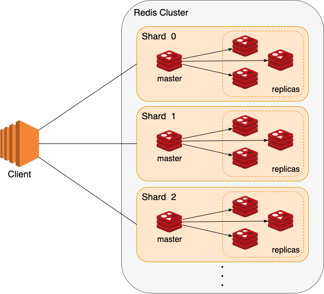

# Vigil Interview Code Challenge


## First Solution
There are two classes which are responsible for:

1. LocalStorageManager reads all the CSV and TSV files and converts data to a List[(Long, Long)].

2. VigilInterviewProblem provides a solution to the problem.

## How this solution works
We gather all the values for a specific key and XOR all the values with each other to find the value that occurs an odd number of times. For example, if key 8 and key 4 are associated with the following values:
```aidl
8 -> 12
8 -> 0
8 -> 0
8 -> 12
8 -> 0

4 -> 22
4 -> 5
4 -> 22
4 -> 6
4 -> 6
```

we are going to calculate xor of following:

we calculate the XOR of the following:

12 ^ 0 ^ 0 ^ 0 ^ 12 ^ 0 = 0

22 ^ 5 ^ 22 ^ 6 ^ 6 = 5

and we append 8 -> 0 and 4 -> 5 to the output.

Here's the source code for the solution:

```scala
  def solveTheProblem(): Unit = {
  println("Starting to calculate the output")
  val result = localStorageManager.readAllKeyValueFromFile()
    .groupBy(_._1)
    .mapValues { vs =>
      vs.map(_._2).foldLeft(0L)(_ ^ _)
    }.toList
  localStorageManager.writeToOutput(result)
}
```
We read all the lines from the files and convert them to a List[(Long, Long)]. Then we group by the key and XOR all the values associated with the same key to get the result.

The time complexity of this algorithm is O(n) (assuming the sum of lines in all the files is n) and the space complexity is M(n). We assume all the data fits in memory, but we'll discuss a solution for handling huge amounts of data that cannot fit in one machine.

## Second Solution

In the previous solution, we assumed that all lines (n) could fit in memory. However, now we need to account for the scenario where we have a massive amount of data that cannot fit in the memory or disk of a single machine. We assume that the /input directory is located on a remote server, which we can mount. Due to memory limitations, we can only read files line by line, as it's possible for a single file to exceed our memory capacity.

We aim to use Redis database to address this specific problem, and we assume that we have multiple nodes in our Redis cluster. Redis utilizes sharding to distribute data across the cluster, and each node stores a portion of the data at any given time.
As the amount of data increases, we can add more nodes to the Redis cluster to accommodate the higher demand.



Our process involves reading each key from a file and retrieving the associated value from Redis. We will then XOR this value with the new value that we have read from the file and store the result back into Redis. Once we have completed this step for all the keys in the file, we will dump all the key-value pairs we have stored into an output file located on a remote server that can accommodate files of any size. By doing so, we can ensure that the data is safely and securely stored without any concerns about file size limitations.

//below needs rewrite

To Speed up the proccess of reading from file after retreving list of tsv and csvs from input/ directory we will distribute the process between multiple threads.

